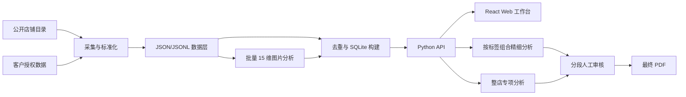
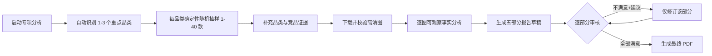

# Fashion Scope

Fashion Scope 是一套面向女装品牌、商品与电商视觉研究的全栈分析系统。系统把公开店铺目录、商品图片、评论/UGC 候选信号以及客户提供的数据统一为可查询的数据快照，并提供商品检索、图片索引、15 维视觉标签、跨店精细视觉分析、店铺诊断、竞品对比、人工审核和 PDF 报告生成能力。

本文既是项目说明，也是客户评审基线。文中的“已实现”均来自当前代码或本地数据库；未来设想、已知限制和建议修改项会单独标明，避免把代理指标、旧页面文案或规划能力误认为当前事实。

## 1. 产品定位

### 1.1 解决的问题

Fashion Scope 主要帮助品牌团队回答以下问题：

- 当前收录了哪些店铺、商品、图片和评论证据？
- 各店的商品结构、价格、促销、在售率和图片密度有什么差异？
- 某类商品在廓形、设计元素、场景、构图、材质、颜色等视觉维度上有哪些共性？
- 在指定视觉标签组合下，各店有哪些可比图片和潜在竞品 SKU？
- 品牌现有商品图的优势、问题和可执行的视觉升级方向是什么？
- 如何让 AI 结论保留图片证据、置信度和人工审核记录，并生成可交付 PDF？

### 1.2 目标用户

- 品牌与商品负责人：查看品类、价格和商品结构。
- 视觉、电商与内容团队：研究图片表达、拍摄方法和视觉一致性。
- 市场与竞品研究人员：比较店铺公开快照，发现候选竞品和证据缺口。
- 管理层与客户：审核分析结论，提出修改意见，下载最终报告。
- 数据与研发团队：维护采集、标准化、AI 分析、数据库和部署链路。

### 1.3 重要边界

系统是“外部公开数据 + 客户授权数据”的研究工具，不是交易、订单或经营 BI 系统。

- 公开浏览量、Top Seller、Estimated sold、榜单和评论量只能作为各自来源内的代理信号，不能直接称为真实销量、GMV、转化率或市场份额。
- 不同店铺的市场、渠道、评论口径和采集时间可能不同；跨店比较必须阅读页面中的证据等级与限制。
- 当前分析是快照型横截面。没有持续 8–12 周的同口径时间序列时，不应把单次变化称为趋势。
- AI 视觉结论是有证据的分析建议，不是 CTR/CVR 因果结论；经营影响仍需内部数据或 A/B 测试验证。
- 当前服务没有用户登录、角色权限和租户隔离，不应在未增加访问控制前直接作为多客户公网 SaaS 使用。

## 2. 系统全景



系统采用单体式轻量架构：React/Vite 负责前端，Python `ThreadingHTTPServer` 同时提供静态文件和 JSON API，SQLite 保存查询数据，后台线程执行视觉分析和报告任务，ReportLab 生成 PDF。

## 3. 当前数据范围

当前代码定义了五个独立数据源：

| 数据源 | 展示名称 | 主要来源 | 典型用途 |
| --- | --- | --- | --- |
| `princess_polly` | Princess Polly | Shopify 官方目录及已留存评论/外部证据 | 商品、价格、图片、商品级评论、竞品对比 |
| `motel` | Motel Rocks | Shopify 官方目录及品牌级评论片段 | 商品、价格、图片、竞品对比 |
| `prettylittlething` | PrettyLittleThing | 美国站官方搜索索引 | 商品、价格、图片、浏览热度代理、Top Seller |
| `aloruh_shein` | Aloruh(shein) | SHEIN SG 官方目录与商品页 | Aloruh 对标商品、公开 Estimated sold/Bestseller 代理、报告目标店铺 |
| `aloruh_local` | Aloruh(local) | 自有站快照和客户本地图片 | 客户商品及大规模视觉标签分析 |

仓库内 `app/explorer.db` 在本次文档核对时的只读统计如下；这是一份 2026-08-18 代码快照，不代表线上实时数据：

| 数据源 | 商品 SKU | 图片索引 | 评论记录 | 已有图片分析记录 |
| --- | ---: | ---: | ---: | ---: |
| Aloruh(local) | 10,487 | 10,771 | 0 | 10,466 |
| Aloruh(shein) | 2,848 | 4,352 | 0 | 343 |
| Motel Rocks | 4,422 | 26,676 | 28 | 2,141 |
| PrettyLittleThing | 25,495 | 127,827 | 36 | 7,353 |
| Princess Polly | 17,008 | 119,205 | 500 | 5,613 |

> 注意：前端“方法与来源”页的部分覆盖数量目前写在 `SourcesView.jsx` 中，不是从数据库动态生成，因此与上表已有漂移。这是客户修改建议中的 P0 项。

## 4. 功能模块总览

| 导航模块 | 主要能力 | 输入 | 输出 |
| --- | --- | --- | --- |
| 总览 | 核心指标、品类结构、近期商品、快捷问数 | 店铺筛选 | 指标卡、品类图、商品卡、问答 |
| 商品与 SKU | 商品搜索、筛选、排序、分页、详情 | 店铺、品类、关键词、在售、排序 | 商品列表和商品详情 |
| 图片索引 | 按商品图浏览、筛选和查看关联商品 | 店铺、品类、关键词、在售 | 图片卡片和详情抽屉 |
| 维度分析 | 15 维标签选择、AND 组合筛选、多店展示 | 维度、标签、店铺 | 命中图片、分店结果、统计 |
| 进一步精细分析 | 下载高清图并做跨店 AI 视觉诊断 | 固定标签组合、店铺、图片样本 | 逐图分析、店铺总结、建议、测试假设 |
| 视觉报告 | 自动选重点品类、专项分析、分段审核、PDF | Aloruh(shein)、抽样参数、修改意见 | 五部分分析及最终 PDF |
| 热度与评论 | 展示不同来源的热度和评论证据 | 店铺筛选 | 覆盖、代理排行、评论样本和解释 |
| 店铺剖析 | 单店商品、价格、视觉和证据诊断 | 单个店铺 | 指标、观察、假设和证据等级 |
| 竞品分析 | 两店横截面对比、视觉差异、候选 SKU | 店铺 A、店铺 B | 对比表、图表、候选对和限制 |
| 数据问答 | 对已采集 SQLite 数据做受控问答 | 自然语言问题 | 支持状态、答案、置信度 |
| 方法与来源 | 说明来源、采集、口径、证据和后续工作 | 店铺筛选 | 方法论与数据边界说明 |

## 5. 详细功能说明

### 5.1 全局导航与店铺筛选

- 左侧导航通过 URL Hash 切换 10 个业务视图，刷新后可保留当前页面。
- 顶部店铺选择会影响总览、商品、图片、热度、店铺剖析和部分方法说明。
- “店铺剖析”在未选择店铺时默认进入 Princess Polly。
- 页面从 `/api/summary` 拉取当前筛选下的商品、图片、下载样本和评论指标。
- API 错误会在页面顶部显示；当前没有全局自动重试、离线提示或统一错误编号。

### 5.2 总览

总览提供一个面向管理者的快速入口：

1. 核心指标：商品 SKU、图片索引、已下载样本和评论记录。
2. 品类结构：展示当前范围内 SKU 数量最多的五个品类，并用颜色区分各店贡献。
3. 近期商品图：取在售商品并按最新顺序展示前五款，可跳转图片索引。
4. 快捷问数：预置“哪家店的连衣裙 SKU 最多”等问题，也可输入自定义问题。
5. 数据状态：提示页面覆盖官网目录、图片、评论、UGC 和外部证据，但各来源实际覆盖仍以方法页和数据库为准。

### 5.3 商品与 SKU

商品页以商品为单位，支持：

- 按店铺和标准化品类筛选。
- 按标题关键词搜索。
- 只看当前在售商品。
- 按目录顺序、最新、价格或其他后端支持的字段排序。
- 分页浏览，默认每页 24 条。
- 点击商品卡打开详情抽屉，查看标题、价格/原价、折扣、颜色、尺码、可售状态、来源链接、多张商品图和已有视觉分析标签。
- 商品详情以 `(store_id, product_id)` 唯一定位，避免不同店铺 ID 冲突。

标准化品类由原始类目字符串映射得到，例如 Dress→DRESSES、Top→TOPS、Pant/Trouser→TROUSERS。未匹配品类保留截断后的原始文本，客户评审时应关注类目词典是否符合业务口径。

### 5.4 图片索引

图片页复用商品浏览器，但以图片为主，默认每页 40 条：

- 每条图片保留所属店铺、商品 ID、图片位置和来源 URL。
- 图片 URL 在单店范围内唯一；数据库同时以 `(store_id, product_id, position)` 做主键。
- 点击图片可回看商品信息和同一商品的其他图片。
- “图片索引”表示系统保存了来源链接，不等于图片文件已下载，也不等于链接一定是原图/高清图。
- URL SHA-256 用于追踪链接；只有实际下载的文件才能计算文件内容 SHA-256。

### 5.5 15 维图片标签分析

系统当前的 `fashion-image-v2` 标签体系包含：

1. 商品类别
2. 廓形与版型
3. 设计元素
4. 穿着场景
5. 画面构图
6. 视角与动作
7. 卖点部位
8. 拍摄场景
9. 材质与纹理
10. 色彩与图案
11. 视觉语言
12. 搭配方式
13. 光线
14. 模特状态
15. 图文叠加

每张已分析图片保存分析版本、状态、方法、每个维度的一个或多个标签及 0–1 置信度。商品类别强制只有一个标签；其他维度最多可有多个标签；不可观察时使用 `UNKNOWN`，且不会与其他标签同时出现。

批量分析支持缓存和增量执行：已存在且版本一致的结果可复用，新增或旧版本记录再调用模型。批次大小限制为 1–32，并发数限制为 1–16；结果必须完整覆盖请求键，防止模型漏返回或额外生成记录。

### 5.6 多维固定组合筛选

维度分析页把上述标签转换为客户可操作的组合查询：

1. 勾选一个或多个分析维度。
2. 为每个已选维度指定一个具体标签。
3. 选择需要展示的店铺，至少保留一家。
4. 系统用 AND 逻辑筛选，即图片必须同时包含每个已选标签。
5. 结果按店铺分组，展示命中图片和可分析样本。

例如“商品类别=上衣 AND 设计元素=露背 AND 场景=派对”只返回同时满足三项的图片。当前不支持同一维度内 OR、多套条件保存、排除条件、相似标签召回或条件之间的权重。

### 5.7 进一步精细视觉分析

用户可在固定组合结果上启动第二阶段分析：

- 可以按店铺随机选样，也可以手动选择具体图片。
- 自动模式每店可选 1–8 张，总图片数最多 24 张；手动选择会校验图片确实属于当前过滤结果。
- 系统先尝试解析并下载高清图片，再验证格式、像素数和边长。当前最低门槛为 800,000 像素、长边 1,000 像素、短边 600 像素。
- 高清图准备完成后，调用 Azure OpenAI `gpt-5.6-sol`，使用高细节图像输入做跨店分析。
- 任务状态包含排队、下载高清图、Sol 视觉分析、完成或失败；前端轮询进度。

输出包括：本次选择逻辑、跨店共同模式与差异、每店视觉定位及不一致点、建议拍摄体系、A/B 测试假设、逐图可观察事实/优缺点/建议/证据/置信度，以及模型用量与费用摘要（前提是运行记录包含定价信息）。

分析完成后可按五个 Section 做“满意/不满意”审核。不满意必须填写修改建议，单条建议最多 2,000 字；审核记录保存为 JSON。

### 5.8 视觉报告工作流

视觉报告是一个独立于维度筛选的整店分析流程，当前模板只支持 `Aloruh(shein)`：



专项分析的五部分为：品牌视觉定位校准、商品展示分析、店铺视觉审计、竞品视觉差距、视觉升级方向。

系统默认自动识别前三个重点品类，每个重点品类随机抽取 20 款；客户可把重点品类数调为 1–3，把每品类样本调为 1–40。抽样种子绑定任务 ID，任务内可复核。目标商品最多展开前两个图片视角；竞品只从已有完整标签且品类可比的图片中选证据。

每个结论保存支持图、反例图或示例图 ID，并检查引用是否真实存在。竞品差距部分还会验证品牌名称与对应品牌图片证据是否匹配。报告明确排除曝光、点击、转化、销量、ROI、人群画像、代表红人和敏感模特属性推断。

审核规则：

- 点“满意”会保存该部分批准状态。
- 点“不满意”必须填写建议，系统只重新生成该部分并保留其余部分。
- 修订完成后该部分需要重新审核。
- 只有五部分全部为“满意”时，后端才允许生成最终 PDF。
- PDF 支持浏览和下载；分析、修订和 PDF 任务会分别显示运行状态和用量。

### 5.9 热度与评论

热度与评论页有意把不同口径拆开：

- 数据覆盖：按店展示公开热度、评论和 UGC 的可用程度。
- Aloruh(shein) Estimated sold：只作为 SHEIN SG 页面公开代理，非订单量。
- PLT 浏览热度：按商品族去重，但统计周期未知，只适合同源排序。
- 商品评论排行：只对能关联 SKU 的评论进行商品级展示。
- 近期评论样本：品牌级评论不会归因到具体商品。
- 整体分析：基于当前外部快照解释可见现象，并提示缺失项。

### 5.10 店铺剖析

店铺剖析把单店证据分为四层：

- 经营外观指标：SKU、价格中位数、促销覆盖、在售率、平均图片数；有公开代理时额外展示覆盖商品数。
- 品类与客群证据：品类份额、评论主题、UGC 候选及其覆盖范围。
- 视觉系统：亮度、饱和度、冷暖、边缘密度、中性背景比例和样例图。
- 解释与行动：官方事实、代理指标、证据缺口、优化假设、预期影响和验证条件。

页面不会用评论缺失推断“没有评价”，也不会根据图片推断年龄、收入、种族或健康等敏感属性。

### 5.11 竞品分析

竞品页允许选择两家不同店铺，提供价格中位数、促销率、在售率、图片密度、核心品类、主图视觉特征和潜在竞品 SKU 对比。

候选 SKU 匹配以同品类为硬条件，基础同品类 45 分、价格接近最多 25 分、标题/风格词相似最多 20 分、可用热度代理最多 10 分，每店候选池最多 120 款。该分数仅用于发现可能的替代关系，不代表销量竞争强度或消费者真实比较概率。

### 5.12 数据问答

问答模块不是开放式大模型聊天，而是对支持意图执行受控 SQLite 聚合。当前适合回答某品类 SKU 数量、图片索引数量、价格中位数和在售/售罄数量等问题。

返回结果包含 `supported`、答案文本和置信度。无法映射到已支持意图的问题应明确返回不支持，而不是编造答案。输入长度在服务端截断为 500 字。

### 5.13 方法与来源

该页向客户披露目录适配器、字段标准化、去重规则、视觉方法、代理指标、证据等级、采集安全边界、内部数据缺口和后续工作。它是报告解释的重要组成部分，但当前部分统计为前端硬编码，因此应改为从数据库和运行清单动态生成。

## 6. 数据处理与存储

### 6.1 采集与标准化

`pipelines/collection/` 按店铺适配不同公开入口：Shopify 目录、官方搜索索引、SHEIN 目录/商品页以及客户文件。标准化后主要形成 catalog、images、reviews、UGC、visual features 和 image analysis 等 JSON/JSONL 文件。

### 6.2 去重规则

- 商品主键：`(store_id, product_id)`。
- 图片主键：`(store_id, product_id, position)`。
- 图片链接唯一约束：`(store_id, source_url)`，用于阻止同一店铺内跨 SKU 重复 URL。
- 评论主键：`(store_id, review_id)`。
- 数据库构建完成后会按保留图片重新计算商品 `image_count` 和 `primary_image_url`。

### 6.3 SQLite 表

| 表 | 内容 |
| --- | --- |
| `products` | 商品、品类、价格、库存、榜单/代理、来源与快照字段 |
| `images` | 商品图片位置、来源 URL、URL 哈希、样本标记 |
| `reviews` | 评论范围、时间、评分、文本、主题、情绪与来源 |
| `visual_features` | 可复算的亮度、饱和度、冷暖、边缘和背景特征 |
| `image_analysis` | 每张图片的分析版本、状态、方法、标签和置信度 JSON |
| `image_analysis_tags` | 拆开的维度—标签—置信度，供筛选和聚合 |
| `metadata` | 评论/UGC/下载数量等快照元数据 |

数据库通过临时 `.building` 文件完整构建，成功后再原子替换，减少生成中断造成半成品数据库的风险。

## 7. API 概览

| 方法 | 路径 | 用途 |
| --- | --- | --- |
| GET | `/healthz` | 服务健康与快照日期 |
| GET | `/api/summary` | 总览指标与品类结构 |
| GET | `/api/categories` | 品类及数量 |
| GET | `/api/products` | 商品筛选、排序和分页 |
| GET | `/api/products/{store}/{product_id}` | 商品详情 |
| GET | `/api/images` | 图片索引筛选和分页 |
| GET | `/api/image-dimensions` | 维度选项、标签数量和组合结果 |
| GET/POST | `/api/detailed-analysis` | 列出/启动精细视觉分析 |
| GET | `/api/detailed-analysis/{job_id}` | 查询精细分析进度和结果 |
| POST | `/api/detailed-analysis/{job_id}/reviews/{section_id}` | 审核精细分析 Section |
| GET | `/api/engagement` | 热度和评论分析 |
| GET | `/api/analysis` | 店铺剖析和竞品分析 |
| POST | `/api/ask` | 受控数据问答 |
| GET/POST | `/api/report-analyses` | 列出/启动整店专项分析 |
| GET | `/api/report-analyses/{job_id}` | 查询专项分析进度和结果 |
| POST | `/api/report-analyses/{job_id}/reviews/{section_id}` | 批准或修订报告 Section |
| POST | `/api/reports/generate` | 在全部批准后生成 PDF |
| GET | `/api/report-generation/{job_id}` | 查询 PDF 任务状态 |
| GET | `/api/reports` | 列出报告 |
| GET | `/api/reports/{report_id}` | 报告元数据 |
| GET | `/api/reports/{report_id}/file` | 在线查看或下载 PDF |

POST 请求体上限为 16 KB。JSON API 使用 `Cache-Control: no-store`；PDF 使用私有 5 分钟缓存。当前 API 没有认证、速率限制、CSRF 防护、审计用户标识或 OpenAPI 文档。

## 8. 目录结构

| 目录 | 内容 | 主要入口 |
| --- | --- | --- |
| `app/` | React 前端、Python API、SQLite 构建、审核和 PDF | `server.py`、`database_builder.py`、`report_pdf.py` |
| `app/src/` | 10 个业务视图、API 客户端和样式 | `App.jsx`、`api.js` |
| `pipelines/collection/` | 多店采集、标准化、证据整理和数据准备 | `collect_catalogs.py`、`collect_aloruh_shein.py` |
| `pipelines/analysis/` | 15 维分类、高清图解析、精细分析和整店报告分析 | `analyze_explorer_images.py`、`analyze_dimension_selection.py`、`report_analysis_runner.py` |
| `pipelines/reporting/` | 早期独立报告原型，保留作版式和结果对照 | `build_aloruh_visual_report_image_led.py` |
| `slides/fashion-scope/` | 技术架构与产品体验 PPT 的可复现源码和资产 | `build_deck.mjs` |
| `output/` | PPTX、PDF 和报告相关成品 | — |
| `data/` | 本地 JSON/JSONL 数据和分析中间结果，不应提交敏感内容 | — |

`research/` 属于历史研究材料，不是当前生产代码入口。`app/explorer.db`、`app/runtime/`、图片缓存、`.env`、访问令牌和客户原始文件都应作为运行数据管理。

## 9. 本地运行

### 9.1 环境要求

- Python 3.11+
- Node.js 20+
- npm
- 可用的 `data/` 标准化数据，或已有 `app/explorer.db`
- 仅在运行 AI 分析时需要 Azure OpenAI 访问权限

### 9.2 安装与启动

```powershell
cd app
python -m venv .venv
.\.venv\Scripts\python -m pip install -r requirements-production.txt
npm ci
npm run build
python server.py --port 4180
```

访问 `http://127.0.0.1:4180`。如果 `app/explorer.db` 不存在，服务会从根目录 `data/` 自动构建。也可显式执行：

```powershell
cd app
python server.py --build-only
```

强制按当前数据重建：

```powershell
cd app
python server.py --rebuild --build-only
```

开发前端时可另开终端运行 `cd app` 后执行 `npm run dev`。

### 9.3 环境变量

| 变量 | 是否必需 | 用途 |
| --- | --- | --- |
| `AZURE_OPENAI_ENDPOINT` | AI 任务必需 | Azure OpenAI Responses API 端点 |
| `AZURE_OPENAI_KEY` | AI 任务必需 | API Key，禁止提交 Git |
| `FASHION_SCOPE_DATA_DIR` | 可选 | 覆盖根目录 `data/` 路径 |
| `FASHION_SCOPE_ANALYSIS_SCRIPTS` | 可选 | 覆盖分析脚本目录 |
| `FASHION_SCOPE_DETAILED_OUTPUT_DIR` | 可选 | 精细分析任务输出目录 |
| `FASHION_SCOPE_REPORT_ANALYSIS_OUTPUT_DIR` | 可选 | 报告专项分析输出目录 |
| `FASHION_SCOPE_REPORT_PDF_DIR` | 可选 | PDF、审核和最终报告目录 |
| `FASHION_SCOPE_DETAILED_HISTORY_ROOT` | 可选 | 兼容读取历史精细分析结果的位置 |

当前 Web 触发的精细分析和专项报告模型固定为 `gpt-5.6-sol`。不要把密钥写进 README、源码、命令历史或发布包。

## 10. 验证

```powershell
# 前端
cd app
npm ci
npm run build

# 后端与 PDF
python -m unittest test_server.py test_report_pdf.py -v

# 采集
cd ..\pipelines\collection
python -m unittest test_collect_catalogs.py test_collect_aloruh_shein.py -v

# 分析
cd ..\analysis
python -m unittest discover -p "test_*.py" -v
```

测试通过只说明代码逻辑满足测试样例。生产交付还应验证真实数据库计数、API、桌面/移动端页面、图片加载、后台任务状态转换、PDF 内容和部署后的健康检查。

## 11. 部署方式

前端先由 Vite 构建到 `app/dist/`，Python 服务同时托管静态文件和 API。生产部署脚本为 `app/deploy_kevindigital.sh`，用于解压已经构建好的发布归档、切换运行目录并重启服务。

当前架构适合单团队、低并发、研究型工作台。后台任务通过进程内线程和锁执行：同一时间只允许一个专项报告分析/修订任务；服务重启时内存中的活动状态可能丢失，已写入磁盘的任务文件和结果可重新读取。若客户要求多用户并发、高可用或可追责审计，应把任务执行迁移到持久化队列并增加数据库化状态机。

## 12. 已知限制与客户优先修改建议

### P0：交付前应处理

1. **把来源覆盖数量改为动态数据。** `SourcesView.jsx` 仍保存旧的静态计数，与 `explorer.db` 已不一致。建议增加 `/api/source-coverage`，由数据库与采集清单生成商品、图片、评论、UGC、分析覆盖和快照时间。
2. **增加身份认证与权限。** 当前任何可访问服务的人都能读取数据、启动高成本 AI 任务、提交审核意见和下载 PDF。至少需要登录、客户/项目隔离、只读/分析/审核/管理员角色和操作审计。
3. **明确客户数据隔离。** 当前店铺 ID 和报告模板写死在代码中。多客户场景应增加 tenant/project 数据边界、独立存储路径、密钥策略和删除/保留规则。
4. **确认报告轮询与失败恢复。** 客户需要看到排队、下载、分析、修订、生成和失败的稳定状态；服务重启后应能恢复任务，失败任务应支持受控重试。
5. **统一快照日期。** `SNAPSHOT`、来源页近期窗口、数据库实际更新时间和 PDF 生成时间应来自同一份运行清单，避免页面同时出现多个不一致日期。

### P1：提升客户使用体验

1. 维度筛选增加同维度 OR、排除条件、已保存组合和分享链接。
2. 商品/图片页增加批量选择、收藏、对比清单和 CSV/XLSX 导出。
3. 报告模板从仅支持 Aloruh(shein) 改为可选择目标品牌、市场、品类和对标店铺。
4. 增加报告版本号、审核人、审核时间、修改历史和前后版本差异。
5. 在每个图表和结论旁显示样本量、覆盖率、采集日期和证据链接。
6. 增加可访问性、移动端、加载骨架、空状态、重试按钮和统一错误提示。
7. 为 AI 任务提供预计图片数、预计时间、模型和成本上限，并允许取消任务。

### P2：形成长期产品能力

1. 建立每周目录快照和日/周级重点商品追踪，形成真正的趋势时间序列。
2. 接入内部订单、转化、退货和投放数据，用受控实验验证视觉建议。
3. 引入持久化任务队列、对象存储、集中日志、指标告警和自动备份。
4. 对标签模型做人工金标集、准确率/召回率、漂移和版本回归评估。
5. 增加跨来源实体匹配和图片内容哈希，区分“同 URL”“同内容”和“相似图片”。
6. 建立数据保留、删除、授权到期、来源规则和合规审计流程。

## 13. 给客户的修改建议填写模板

为减少“想改一下”但无法验收的情况，建议每条意见使用以下格式：

| 字段 | 示例 |
| --- | --- |
| 页面/模块 | 维度分析 |
| 当前问题 | 同一维度只能选择一个标签，无法同时查看黑色或白色连衣裙 |
| 期望行为 | 同一维度支持 OR，不同维度继续使用 AND |
| 使用角色 | 视觉研究人员 |
| 优先级 | P1 |
| 数据口径 | 图片数；同一图片只计一次 |
| 验收标准 | 选择“黑色 OR 白色”与“连衣裙”后，返回并集；刷新后条件仍保留 |
| 示例/附件 | 截图、目标页面或期望报告样例 |

客户评审时建议优先确认五个决策：

1. 系统是内部研究工具，还是需要给多个外部客户登录使用？
2. 报告目标是否仍固定为 Aloruh(shein)，还是要支持任意品牌和市场？
3. 哪些指标属于正式经营 KPI，哪些只能作为公开代理信号？
4. 客户最常用的筛选、导出、审核和分享流程分别是什么？
5. 最终验收以页面、API、PDF、数据准确率还是业务实验结果为准？

## 14. 安全与合规

- 仓库不得保存 `.env`、访问令牌、Cookie、验证码、客户账号或明文密钥。
- 采集只使用公开入口或客户明确授权的数据，不绕过验证码、付费墙和访问控制。
- 外部输入需经过类型、范围、路径和请求体大小校验；当前服务已校验主要任务参数和 Job ID，但仍需要正式认证与限流。
- PDF、运行输出和客户图片可能包含商业敏感信息，应放在访问受控的存储中，并定义保留和删除策略。
- 发布前应检查归档内容、Git diff、敏感信息、依赖漏洞和第三方来源授权。

## 15. 关键代码入口

- 前端路由与导航：`app/src/App.jsx`
- 前端 API 客户端：`app/src/api.js`
- Python Web/API 服务：`app/server.py`
- SQLite 构建：`app/database_builder.py`
- 数据查询层：`app/data_store.py`
- 店铺与竞品分析：`app/analysis.py`
- 维度筛选：`app/image_dimensions.py`
- 图片标签体系：`pipelines/analysis/fashion_image_analysis.py`
- 高清图解析：`pipelines/analysis/high_resolution_images.py`
- 固定组合精细分析：`pipelines/analysis/analyze_dimension_selection.py`
- 整店报告专项分析：`pipelines/analysis/report_analysis_runner.py`
- Section 审核：`app/report_reviews.py`
- PDF 生成：`app/report_pdf.py`
- 生产部署：`app/deploy_kevindigital.sh`

---

版本说明：本文按当前 `codex/whitepaper-report-coverage` 分支和本地 `explorer.db` 核对。数据量、线上部署状态和外部来源可随采集与发布变化；正式对外发送前，应重新运行验证并更新动态快照。
