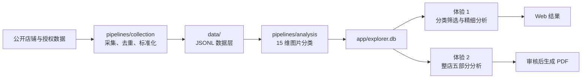

# Fashion Scope

Fashion Scope 是一个面向时尚店铺视觉研究的全栈项目：采集公开店铺目录和客户提供的数据，将商品图片标准化并进行 AI 标签分析，支持“分类后分析”和“整店分析生成 PDF”两种体验。

## 代码在哪里

| 目录 | 内容 | 主要入口 |
| --- | --- | --- |
| [`app/`](app/) | React 前端、Python API、SQLite 数据构建和 PDF 生成 | `app/server.py`、`app/src/`、`app/report_pdf.py` |
| [`pipelines/collection/`](pipelines/collection/) | Princess Polly、Motel Rocks、PrettyLittleThing、Aloruh 等店铺采集与标准化 | `collect_catalogs.py`、`collect_aloruh_shein.py` |
| [`pipelines/analysis/`](pipelines/analysis/) | 15 个视觉维度分类、体验 1 精细分析、体验 2 整店报告分析、图片缓存 | `analyze_explorer_images.py`、`analyze_dimension_selection.py`、`report_analysis_runner.py` |
| [`pipelines/reporting/`](pipelines/reporting/) | 早期独立 PDF 原型生成器，保留作版式和结果对照 | `build_aloruh_visual_report_image_led.py` |
| [`slides/fashion-scope/`](slides/fashion-scope/) | 技术架构与产品体验 Slides 的可复现源码和图片资产 | `build_deck.mjs` |
| [`output/`](output/) | 当前提交的 PPTX、PDF 和来源说明成品 | — |

`research/` 只保留历史研究数据和过程文件，不再承载生产代码。`data/`、`app/explorer.db`、图片缓存和密钥属于本地运行数据，不提交到 Git。

## 工作流



## 本地启动

要求：Python 3.11+、Node.js 20+。首次运行还需要将标准化 JSONL 数据放入根目录 `data/`，或将已有的 `explorer.db` 放入 `app/`。

```powershell
cd app
python -m venv .venv
.\.venv\Scripts\python -m pip install -r requirements-production.txt
npm ci
npm run build
python server.py --port 4180
```

然后访问 `http://127.0.0.1:4180`。如果 `app/explorer.db` 不存在，服务会先从 `data/` 构建数据库；也可以单独执行：

```powershell
cd app
python server.py --build-only
```

AI 分析需要通过环境变量提供 Azure OpenAI 配置。仓库不会保存 `.env`、访问令牌、登录态、验证码或客户原始数据。

## 验证

```powershell
cd app
npm run build
python -m unittest test_server.py test_report_pdf.py -v

cd ..\pipelines\collection
python -m unittest test_collect_catalogs.py test_collect_aloruh_shein.py -v

cd ..\analysis
python -m unittest discover -p "test_*.py" -v
```

生产部署脚本位于 `app/deploy_kevindigital.sh`；它接收已经构建并按发布格式打包的归档，不会读取 GitHub 中的本地数据或密钥。
